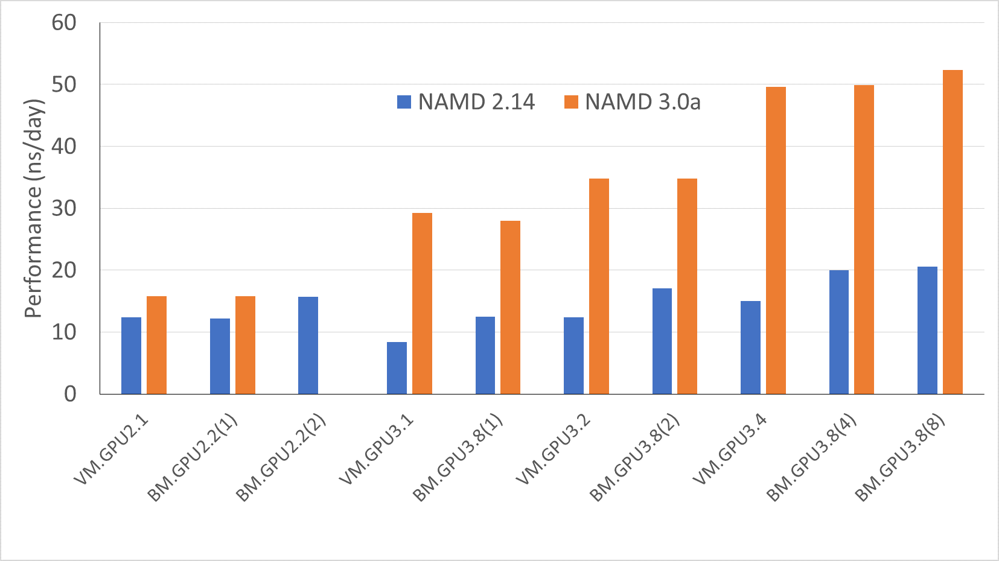
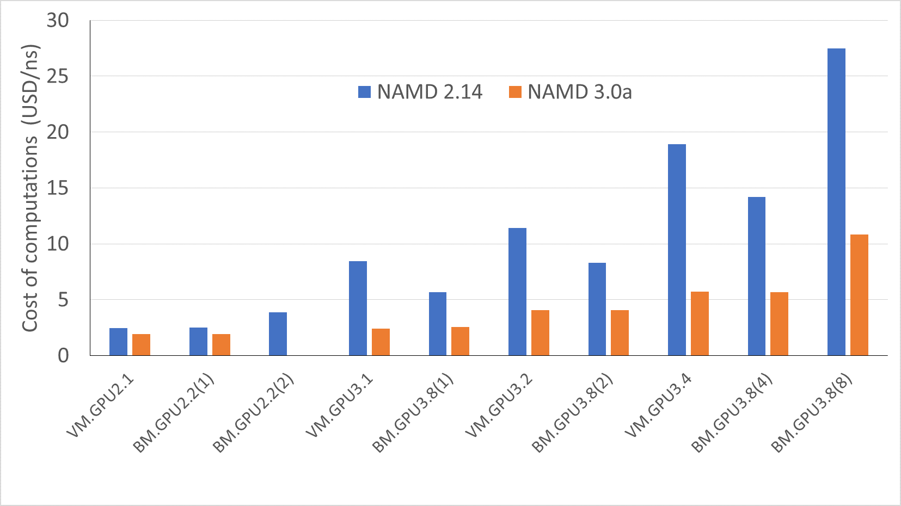
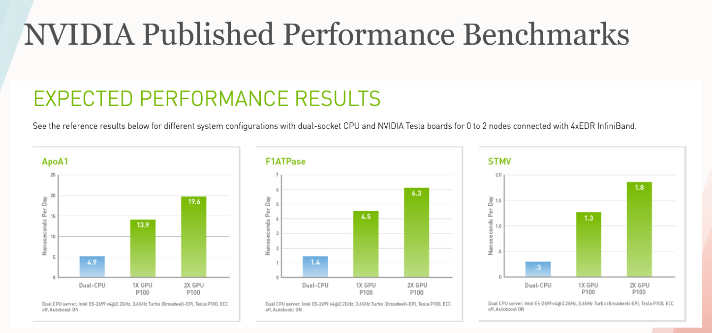
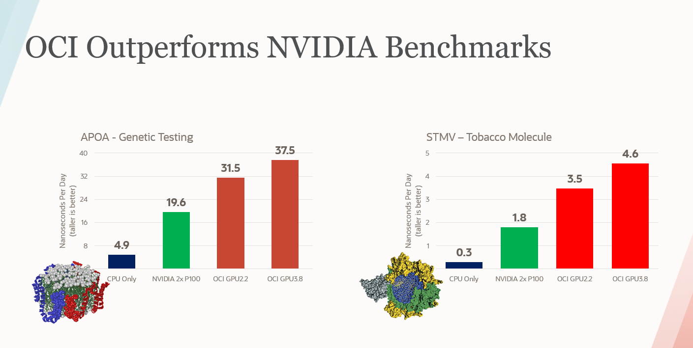

## GPU benchmarking on Drug Cardiotoxicity prediction modeling on Oracle cloud
By Rajib Ghosh, Global Senior Solutions Architect, Oracle for Research

### Research Project
Drug cardiotoxicity describes when a drug to cure one ailment also does harm to a patient’s heart.It is a serious and expensive problem where nearly 10% of drugs in the past decades have been pulled out from clinical market due to cardiovascular concerns. To truly assess cardiotoxicity risk, drugs must be tested in the context of comorbidities: what will this drug to do a patient who already has complicating factors that increase his or her risk of heart problems. The focus of the research project is to use advanced molecular dynamics simulations to develop an AI-driven in silico multi-scale functional model that predicts – in the early stages of drug development. Enterprise scale computing including high performance bare metal CPU and GPU shapes that can be used in combination with GPU accelerated tools accelerates the results by running simulations in an faster and effective manner. More details can found in the Oracle for Research blog [here](https://blogs.oracle.com/oracle-for-research/high-performance-computing-helps-researchers-predict-whether-a-drug-will-harm-your-heart)

### Tools and Techniques 
NAMD  (Nanoscale molecular dynamics) is a parallel molecular dynamics (MD) code designed for high-performance simulation of large biomolecular systems. Based on Charm++ parallel objects, NAMD scales to hundreds of cores for typical simulations and beyond 500,000 cores for the largest simulations. NAMD uses the popular molecular graphics program VMD for simulation setup and trajectory analysis, but is also file-compatible with AMBER, CHARMM, and X-PLOR. NAMD is distributed free of charge with source code and is a prime choice for research intensive computations in the MD space

NAMD 3.0a (alpha) is a single-node, single-GPU, GPU-resident computation mode that can speed up simulations more than 2x times in GPU architectures like NVIDIA Volta or Oracle BMGPU3.8 shapes. The NAMD simulation is geared to maximize performance for medium size molecular dynamics simulations (in the range of 10K to 1M atoms). This range is suitable for computational capabilities of a GPU accelerated compute node using a GPU specific code path that offloads the integrator and rigid bond constraints to the GPU thus bypassing the associated overheads associated with CPU activities that slows down the simulations. At present, only single GPU offloading scheme is available and multi-GPU acceleration of a single-replicate is part of the ongoing development work.

### Molecular dynamics algorithm
Molecular dynamics usually employs a time-stepping algorithm to propagate molecular interactions in time. The timestep algorithms is performed in a nanosecond scale millions of times to evaluate the force and energy atomic interactions. This force calculation comprises about 99% of the computation workload. One of the key steps of this timestep process is numerical integration where calculated forces are applied to atom velocities but it is a low overall computation activity that occupies about 1% of the overall FLOPS of the time step process. This is a CPU computation step and results in a GPU idle time in the overall timestep cycle

With millions of timestep simulations, moving this numerical integration step to the GPU computation cycle removes this GPU idle bottleneck in the overall timestep process and allows the algorithm to execute simulations quickly. 

Molecular dynamics packages that leverages this can perform much faster on high tensor core NVIDIA Volta / turing architecture such as Oracle BMGPU3.8 or BMGPU4.8

Furthermore, MD GPU enablement can also benefit from multi-GPU core use-cases such as multi-replica simulations. This can produce a higher and even performance scaling with GPU enablement as well.

### Research use-case
The simulations were carried out for the research use-case of beta-1 adrenergic receptor - cationic l-sotalol embedded in POPC/POPS mixed lipid bilayer and soaked  by 0.15 M NaCl aqueous solution with CHARMM36m force field, TIP3P water, NPT ensemble, 310 K, 1 Atm pressure, standard cutoffs, PME for electrostatics, Langevin piston) and computational use-case with 244,187 atoms, NAMD 2.14 or 2.14b1 and NAMD3.0 alpha with Oracle cloud Virtual and Bare metal GPU instances (GPU2.x (Pascal) and GPU3.x(Volta)) architectures. The benchmarks are performed using 10ps lobg (5000 MD steps) NAMD runs.

To run an MD simulation on a compute cluster, the user has to specify numerous parameters to control the behavior of the underlying hardware and software. Moreover, optimal parameters might vary between different versions of the same MD engine and depend on the details of the molecular system under consideration. The simulation performance, usually measured in simulated time per day, e.g., ns/day is plotted against the Oracle cloud Virtual and Bare metal shapes. 

The benchmark shows 
1.	GPU accelerated MD simulations software (i,e NAMD 3.0a) results in a 2.5 times performance boost as compared to the CPU versions
2.	Performance gains has scaled at a much higher rate on GPU enabled software that takes advantage of GPU3.x shapes with NVIDIA Volta architecture
3.	Also, potential higher performance gains can be achieved with clustering of these shapes.

An offshoot of the benchmark analysis is the safety pharmacology computation cost expressed in USD/ns. This shows – 
1.	GPU accelerated NAMD3.0 alpha execution costs are about 2-2.5 times lesser than its CPU enabled counterpart NAMD 2.14
2.	NAMD 3.0 alpha showed an even scaling of costs with higher shapes and computational loads and are independent of virtual and bare metal machines used.
3.	Cost scale up at a lower rate with increase of computational load for GPU accelerated NAMD3.0

The expected results of the above benchmarks are in alignment with NVIDIA and Oracle published benchmarks as shown below. 

Further details on NAMD published standard benchmarks can be found in [ApoA1 and STMV](http://www.ks.uiuc.edu/Research/namd/benchmarks/) and [NVIDIA MD benchmarks](https://developer.nvidia.com/blog/delivering-up-to-9x-throughput-with-namd-v3-and-a100-gpu/).
