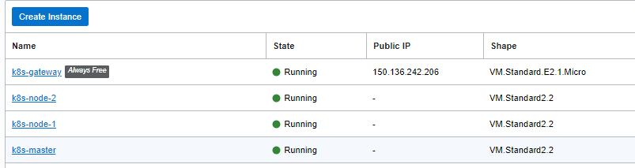
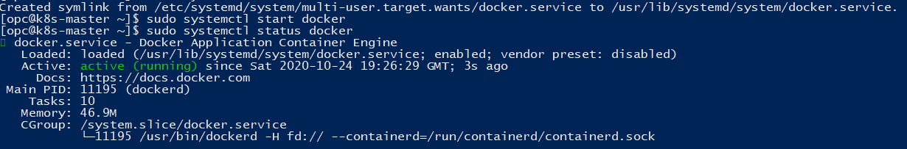

## Setting up kubernetes on Oracle cloud 

### Architecture

### Network
1. Create a compartment k8s
2. Create a VCN using the VCN wizard in the compartment k8s
3. The above network architecture will be automatically created with a public and private subnet

### Installation
1. Create a gateway server in the public subnet
2. Create 3 Oracle Linux 7.8 server in the private subnet. Name them as k8s-master, k8s-node-1 and k8s-node-2
3. Generate a public / private key pair if you do not have a SSH key pair
4. Supply the pre-generated SSH public key while creating the instances
   * The setup after the creation should look like 

**NOTE:** Perform the following steps for the master and the worker nodes 
#### SSH login to nodes from Gateway server
1. Create a private key file *vi ssh-key.key* and paste the content of the private key file 
2. Change the file mode to make is secure for the user trying to connect to *chmod 600 ssh-key.key*
3. *ssh -i ssh-key.key opc@private IP* 

#### Enable UEK5 and perform yum update 
This can take some time - about 15~20 minutes
<pre><code>sudo yum-config-manager --enable ol7_addons
sudo yum-config-manager --disable ol7_UEKR4
sudo yum-config-manager --enable ol7_UEKR5
sudo yum update -y</code></pre> 

#### Reboot the node 
<pre><code>sudo systemctl reboot</code></pre>

#### Check resource requirements 
1. Each node needs a minimum 2GB RAM and 2CPUs
2. A storage volume of at least 10GB is required for /var/lib/kubelet directory
<pre><code>sudo dmidecode -s system-uuid</code></pre>

#### Install docker 
<pre><code>sudo yum install docker-engine -y
sudo systemctl enable docker
sudo systemctl start docker
sudo systemctl status docker</code></pre>
Docker should be running after the above code executes successfully as shown below

#### Check Oracle container registry account 
1. Check https://container-registry.oracle.com to see if you can login through SSO userid and password
2. Check logging in with docker 
<pre><code>sudo docker login container-registry.oracle.com</code></pre>

#### Login as root and setup KUBE_REPO_PREFIX
<pre><code>sudo docker login container-registry-phx.oracle.com
sudo export KUBE_REPO_PREFIX=container-registry-phx.oracle.com/kubernetes
sudo echo 'export KUBE_REPO_PREFIX=container-registry-phx.oracle.com/kubernetes' >> ~/.bashrc</code></pre>

#### Install ntp server
<pre><code>sudo yum install ntp -y
sudo systemctl start ntpd
sudo systemctl enable ntpd
sudo systemctl status ntpd</code></pre>
ntpd service should be active and running after the code above executes successfully

### Reference
* [Oracle k8s install guide](https://docs.oracle.com/en/operating-systems/oracle-linux/kubernetes/kubernetes_install_upgrade.html)
